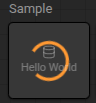
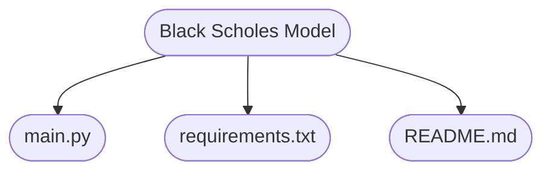
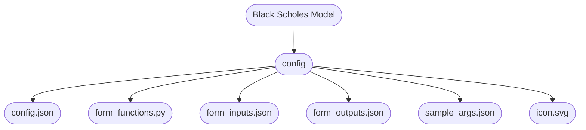
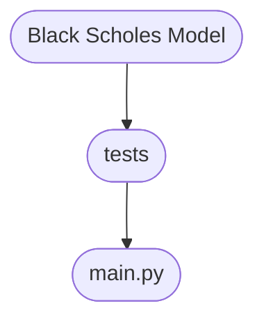
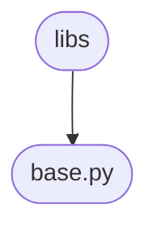

# Development Guide for Everysk Workers

In Everysk, **workers** are like building blocks, which when combined together, can craft powerful workflow solutions. Workers are designed to **create** unique solutions based on the needs of each user.

Users are able to **create** their own workers, to define precise behaviors, integrate with various systems, and address specific requirements efficiently. This approach ensures that workers are not just generic tools but are purpose-built to fit seamlessly into diverse workflows, maximizing productivity and innovation.

Aside from the **customization**, user-deployed workers have the added benefits of version control through [GitHub](https://github.com/), shareable across different users, and easily available when constructing new workflows. User-deployed workers are also **private** so they are not shared with other clients, and the code is not visible in the UI. The document below explains how a user could develop, test, deploy and manage their own worker in the `Everysk` worker library.

## Requirements

Ensure you have the following tools and extensions installed before you begin developing a worker:

### Required
- **Python >= 3.11** - [Installation Guide](https://www.python.org/downloads)

### Optional
- **Visual Studio Code (VS Code)** - Recommended IDE. [Installation Guide](https://code.visualstudio.com/docs/setup/setup-overview)
- **Dev Containers** - [VS Code Extension](https://code.visualstudio.com/docs/devcontainers/tutorial#_install-the-extension)
- **WSL (Windows Subsystem for Linux)** - For Windows users. [Installation Guide](https://learn.microsoft.com/en-us/windows/wsl/install-manual)
- **Git** - Version control system. [Installation Guide](https://git-scm.com/downloads)

---

## Cloning the Repository

To begin developing your worker, clone the **GitHub** repository to your local machine.

### Using Git Command Line
If Git is installed, you can clone the repository via HTTPS:
```bash
git clone https://github.com/Everysk/workers-sample
```

### Using GitHub UI
If Git is not installed, follow these steps:
1. Open the **GitHub repository**: [workers-sample](https://github.com/Everysk/workers-sample)
2. Click the **Code** button (green)
3. Select **Download ZIP**
4. Extract the downloaded ZIP file into your chosen directory

---

## Setting Up Authentication
Before running your worker, define your Everysk API credentials in a `.env` file inside the `workers-sample` folder.

Create a `.env` file and add:
```ini
EVERYSK_API_SID=<your-api-sid>
EVERYSK_API_TOKEN=<your-api-token>
```

Alternatively, run on command line:

```bash
echo EVERYSK_API_SID=<your-api-sid> >> .env
echo EVERYSK_API_TOKEN=<your-api-token> >> .env
```

---

## Deploying the Worker

There are three options for running your worker: **Local Environment, Virtual Environment, and VS Code Dev Containers**. Please select one of these methods.

---

### Local Environment

#### Installing Dependencies
Navigate to the repository folder and install the required Python packages:
```bash
pip install -r requirements.txt
```

#### Deploying the Worker Hello World
To deploy a sample worker and verify setup:
```bash
python run.py deploy wk_hello_world
```
If successful, you can check the worker's status on the Everysk Platform.

---

### Virtual Environment
Using a virtual environment ensures dependencies are isolated. Create and activate a virtual environment as follows:

#### Creating a Virtual Environment
```bash
python run.py venv
```

#### Activating the Virtual Environment
##### On Linux/MacOS:
```bash
source venv/bin/activate
```
##### On Windows:
```bash
venv\Scripts\activate
```

Once activated, deploy the worker:
```bash
python run.py deploy wk_hello_world
```

---

### VS Code Dev Container (Recommended)
For a seamless development experience using **Dev Containers**:
1. Open **Visual Studio Code** in the repository folder
2. Press `Ctrl + Shift + P` (Windows/Linux) or `Cmd + Shift + P` (Mac)
3. Select **Dev Containers: Reopen in Container**
4. After the container is built, use either:
   - **VS Code Tasks:**
     - Press `Ctrl + Shift + P` (or `Cmd + Shift + P` on Mac)
     - Select `Tasks: Run Task`
     - Choose `Everysk - DEPLOY Worker`
     - Enter the worker name (`wk_hello_world`)
   - **Command Line:**
     ```bash
     python run.py deploy wk_hello_world
     ```

---

## Check Building Process

Once you receive a successful deployment message, log in to your Everysk account. Navigate to the Workers Library, where you will see the building process, this process will take a few minutes to complete.




---

## Platform Compatibility
This setup supports **Windows, Linux, and macOS**, so you can develop on any operating system.

After following these steps, you are now ready to start developing your worker!

---

## Planning the Worker

Let's imagine a hypothetical scenario where we wish to create a worker that will receive a **Datastore**, calculate some data using the [Black-Scholes Model](https://en.wikipedia.org/wiki/Black%E2%80%93Scholes_model) and output the modified Datastore.


## Structuring the Code and Files

To create the necessary structure for our worker, if you are using **Visual Studio Code**, we have at our disposal the **Create Folder Structure** Task.

To use it, open the command palette by pressing `Ctrl + Shift + P` and type `Tasks: Run Task` and select the `Create Folder Structure` option. Then write the name of the worker on the pop up that will appear on the top middle of your screen: `black_scholes_model`.

By default, the convention name of the folders for the workers will be: `wk_<worker_name>`. You may choose to remove the prefix `wk_` from the folder name if you wish, this is just a convention.

<br>

Alternatively, to start creating our **worker** we must first create a directory with the name of our worker. In this case, we shall name it `wk_black_scholes_model`. Keep in mind that we are using **Linux** for this segment, feel free to follow along with your operating system:

```bash
mkdir wk_black_scholes_model
```

Then, inside the directory, we create the following subdirectories:

```bash
mkdir -p wk_black_scholes_model/config
mkdir -p wk_black_scholes_model/tests
```

<br>

## Understanding the directories

Below we have the directory structure which we will use as a starting point in order to create our **workers**:

```bash
wk_black_scholes_model
├── config
│   ├── config.json
│   ├── form_functions.py
│   ├── form_inputs.json
│   ├── form_outputs.json
│   ├── sample_args.json
│   └── icon.svg
└── tests
    └── main.py
├── main.py
├── README.md
└── requirements.txt
```

Let's understand how each directory and file behave inside the structure.

<br>



<br>

Below we the three main files which will be located in the root directory of our worker:


### main.py

The `main.py` file is where the worker **logic** is implemented. There we will define the class, import statements, and methods. There is also the option of having more than one python file at the same level.

<br>

### README.md

Inside the markdown file, we will write a **brief** and **concise** description of the worker, what it does, its purpose, and how to use it.

<br>

### requirements.txt

<br>

The `requirements.txt` file is used to **keep track** of all the necessary libraries that the worker needs in order to function properly.

<br>

Alongside the three main files, we will also have the `config` and `tests` directories:


### config

<br>



<br>

The `config` directory, as the name suggests, is where we store the configuration files for our **worker**. The `config` directory will contain the following files:

- `config.json`: Is used to **store** the worker ID, the name of the worker, description, category, and any other **relevant information** about the worker that falls under these conditions. When you first create this file, leave the `id` field empty, as it will be filled automatically when the worker gets deployed.

- `form_functions.py`: This python file also serves as a way of **configuring** the worker by defining methods which will be used to manipulate the structure of the **input** and **output** forms. It can also be used to set a specific worker type, such as `basic` or `forker` and control factors like the visibility of the worker.

- `form_inputs.json`: This file is used to **define** all the necessary fields that the user must fill in order to run the worker.

- `form_outputs.json`: Depending on the input data, the worker may return different outputs, this file is used to **define** the output fields that the worker will return.

- `sample_args.json`: This file is used to **store** the sample arguments that will be used to run the worker. It is used for **debugging** purposes.

- `icon.svg`: The `icon.svg` file is **optional** and it is used to visually personalize and represent the worker inside the platform. The file format must be **SVG** and the size limit is **5KB** .

<br>

### tests



<br>

The `tests` directory is where we **store** the test cases for our **worker**. The `tests` directory will contain a single python file, `main.py`, where we will write all the test cases for the worker.

As an important reminder, the number of **test files** will be equivalent to the number of **python files**.

<br>

## Writing the Logic

Inside the `main.py` file we can start writing the code for our **worker**:

```python

import numpy as np
import pandas as pd
from scipy.stats import norm

from everysk.sdk import WorkerBase
from everysk.sdk.entities import Datastore
from everysk.sdk.entities.tags import Tags

from everysk.core.datetime import DateTime
from everysk.core.object import BaseDict

class BlackScholsModel(WorkerBase):
    """
    The Black Scholes Model class for calculating the Black-Scholes Model.

    Attributes:
        storage_settings (str): Storage settings for storing the worker.
        _datastore (Datastore): Datasore with the securities data.
        entity_name (str): Name of the Datastore to be generated or updated.
        workspace (str): Workspace where the Datastore will be stored.
        expected_headers (list): List of expected headers for the Datastore.
        entity_class (Datastore): Class of the Datastore entity.
    """
    storage_settings = None
    _datastore: Datastore = None
    entity_name: str = 'datastore'
    workspace: str = 'main'
    expected_headers: list = ['date', 'maturity_date', 'op_type', 'K', 'S', 'q', 'r', 'sigma', 'T']
    entity_class: Datastore = Datastore

    def black_scholes_merton(
        self,
        op_type: pd.Series,
        K: pd.Series,
        T: pd.Series,
        S: pd.Series,
        q: pd.Series,
        r: pd.Series,
        sigma: pd.Series
    ):
        """
        Vectorized Black-Scholes-Merton option pricing formula.

        Args:
            op_type (pd.Series): Series of 'C' or 'P' indicating call or put options.
            K (pd.Series): Strike prices.
            T (pd.Series): Times to maturity.
            S (pd.Series): Current stock prices.
            q (pd.Series): Dividend yields.
            r (pd.Series): Annualized risk-free interest rates.
            sigma (pd.Series): Annualized volatilities.

        Returns:
            (np.ndarray, np.ndarray, np.ndarray): d1, d2, and option prices for each row.
        """
        r_log = np.log(1 + r)

        alpha = np.where(op_type.str.upper() == 'C', 1, -1)

        # Compute d1, d2
        d1 = (np.log(S / K) + (r_log - q + 0.5 * sigma**2) * T) / (sigma * np.sqrt(T))
        d2 = d1 - sigma * np.sqrt(T)

        # Price formula
        price = alpha * (
            S * np.exp(-q * T) * norm.cdf(alpha * d1)
            - K * np.exp(-r_log * T) * norm.cdf(alpha * d2)
        )

        return d1, d2, price

    def generate_datastore(self) -> None:
        """
        Generate a new Datastore entity with the Black-Scholes Model data.

        Returns:
            Datastore: The generated Datastore entity.
        """
        datastore = Datastore(
            id=None,
            name=self.script_inputs.input_datastore.name or self.entity_name,
            workspace=self.script_inputs.input_datastore.workspace or self.workspace,
            date=self.script_inputs.input_datastore.date or DateTime.today(),
            link_uid=self.script_inputs.input_datastore.link_uid,
            tags=Tags(self.script_inputs.input_datastore.tags),
            data=self.script_inputs.input_datastore.data
        )
        self._datastore = datastore

    def modify_datastore(self) -> None:
        """
        Method to modify the model with calculated values using a fully vectorized approach.
        """
        datastore = self._datastore

        # Create a DataFrame from your datastore
        datastore_df = pd.DataFrame(datastore['data'][1:], columns=datastore['data'][0])

        # Apply the vectorized function directly to columns
        d1_values, d2_values, price_values = self.black_scholes_merton(
            op_type=datastore_df['op_type'],
            K=datastore_df['K'].astype(float),
            T=datastore_df['T'].astype(float),
            S=datastore_df['S'].astype(float),
            q=datastore_df['q'].astype(float),
            r=datastore_df['r'].astype(float),
            sigma=datastore_df['sigma'].astype(float)
        )

        # Insert results back into the DataFrame
        datastore_df['d1'] = d1_values
        datastore_df['d2'] = d2_values
        datastore_df['price'] = price_values

        # Convert DataFrame back to your original format if needed
        data = [datastore_df.columns.tolist()] + datastore_df.values.tolist()
        datastore_args = Datastore(**datastore)
        datastore_args.data = data
        self._datastore = datastore_args

    def validate_headers(self, headers: list) -> None:
        """
        Method used to validate the headers of the Datastore

        Raises:
            ValueError: If the headers are not as expected.
        """
        if sorted(headers) != sorted(self.expected_headers):
            raise ValueError(f"Headers must be: {sorted(self.expected_headers)}, got: {sorted(headers)}")

    def handle_inputs(self) -> None:
        """
        Process the storage settings to define the way
        the entity will be processed.
        """
        self.storage_settings = self.script_inputs.storage_settings
        self.generate_datastore()
        self.validate_headers(self._datastore['data'][0])

    def handle_tasks(self) -> None:
        """
        Method used to assign the entity attribute to the
        resulting Datastore and validate some Datastore data.
        """
        self.modify_datastore()

    def handle_outputs(self) -> BaseDict:
        """
        After processing is done the resulting entity
        will be returned.
        """
        self._datastore = self.entity_class.script.storage(self._datastore, self.storage_settings)
        return BaseDict(datastore=self._datastore)

def main(args: BaseDict) -> BaseDict:
    return BlackScholsModel(args).run()
```

<br>

## Using the Shared Directory

If you take a look at your directory structure you will notice a `libs` directory in the same level as your worker. This directory can be used to store code that is **shared** between multiple workers. In other words, you can place any repeated code in there and simply import it in your worker.


For that, create a new python file called `base.py` inside the `libs` directory:



<br>

Inside this newly created python file you are now able to add all the repeated code. Doing this gives us the possibility of reusing the functions inside another file:

Lets move our `black_scholes_merton` function to the `base.py` file:

```python

from scipy.stats import norm
from everysk.sdk.worker_base import WorkerBase

class BlackScholsBase(WorkerBase):
    """
    Base class for the Black Scholes Model. This class contains the shared methods that can be used across multiple workers.
    """
    def black_scholes_merton(
        op_type: pd.Series,
        K: pd.Series,
        T: pd.Series,
        S: pd.Series,
        q: pd.Series,
        r: pd.Series,
        sigma: pd.Series
    ):
    """
    Vectorized Black-Scholes-Merton option pricing formula.

    Args:
        op_type (pd.Series): Series of 'C' or 'P' indicating call or put options.
        K (pd.Series): Strike prices.
        T (pd.Series): Times to maturity.
        S (pd.Series): Current stock prices.
        q (pd.Series): Dividend yields.
        r (pd.Series): Annualized risk-free interest rates.
        sigma (pd.Series): Annualized volatilities.

    Returns:
        (np.ndarray, np.ndarray, np.ndarray): d1, d2, and option prices for each row.
    """
    r_log = np.log(1 + r)

    alpha = np.where(op_type.str.upper() == 'C', 1, -1)

    # Compute d1, d2
    d1 = (np.log(S / K) + (r_log - q + 0.5 * sigma**2) * T) / (sigma * np.sqrt(T))
    d2 = d1 - sigma * np.sqrt(T)

    # Price formula
    price = alpha * (
        S * np.exp(-q * T) * norm.cdf(alpha * d1)
        - K * np.exp(-r_log * T) * norm.cdf(alpha * d2)
    )

    return d1, d2, price
```

<br>

Then, back in your **worker** directory, you can import the new class and modify the `BlackScholsModel` class to inherit from the `Base` class, giving us access to the methods without having to rewrite them every time

```python
from libs.base import BlackScholsBase

class BlackScholsModel(BlackScholsBase):
    ...
```

Now you can use the `black_scholes_merton` method in the `BlackScholsModel` class without having to rewrite it.

<br>

## Worker Configuration

Inside the `config.json` file, insert the following information which will be used to **configure** the worker by giving it a unique identifier and also set a few configuration details that will be shown in the **interface**:

```json
{
    "id": "",
    "name": "Black Scholes Model",
    "description": "Worker that calculates the Black-Scholes Model",
    "category": "Calculator",
    "visible": true,
    "version": "v1",
    "icon": "data",
    "type": "BASIC",
    "script_runtime": "python",
    "script_entry_point": "main",
    "tags": [],
    "sort_index": 1,
    "default_output": "SINGLE",
    "ports": [
        {
            "value": "in",
            "label": "IN",
            "type": "input",
            "is_visible": true
        },
        {
            "value": "out",
            "label": "OUT",
            "type": "output",
            "is_visible": true
        }
    ],
    "created": null,
    "updated": null
}
```

<br>

Moving into the `form_functions.py` file, we will define **two** methods that will be used to **manipulate** the storage mode of the worker:

The first one being defined as `storage_mode_create`, create mode just means that a new **Datastore** will be created inside the platform. The second method, `storage_mode_update`, which will be used to update any **Datastore** that already exists inside the platform.

```python
def storage_mode_create(form_data, *args):
    black_schols_model_input = form_data.get('black_schols_model_input', {})
    storage_settings = black_schols_model_input.get('storage_settings', {})
    storage_mode = storage_settings.get('storage_mode', {})
    select = storage_mode.get('select', {})
    value = select.get('value', {})
    return value.lower() == 'create'

def storage_mode_update(form_data, *args):
    black_schols_model_input = form_data.get('black_schols_model_input', {})
    storage_settings = black_schols_model_input.get('storage_settings', {})
    storage_mode = storage_settings.get('storage_mode', {})
    select = storage_mode.get('select',{})
    value = select.get('value', {})
    return value.lower() == 'transient'
```

<br>

In the `form_inputs.json` file, we will define an **input field** that the user must fill in order to run the worker:

```json
[
    {
        "id": "black_schols_model_input",
        "name": "Input",
        "type": "assembler",
        "fields": [
            {
                "id": "input_datastore",
                "name": "Datastore",
                "type": "assembler",
                "paddingLeft": 0,
                "paddingRight": 0,
                "paddingTop": 0,
                "paddingBottom": 0,
                "gridSizeMd": 12,
                "mandatory": false,
                "displayName": true,
                "withoutMessages": false,
                "fields": [
                    {
                        "id": "name",
                        "name": "Name",
                        "placeholder": "",
                        "tipover": "",
                        "paddingLeft": 4,
                        "paddingRight": 0,
                        "paddingTop": 0,
                        "paddingBottom": 0,
                        "gridSizeMd": 12,
                        "mandatory": true,
                        "displayName": true,
                        "withoutMessages": false,
                        "variantOptions": [
                            {
                                "label": "Template Text",
                                "value": "metaString"
                            },
                            {
                                "label": "Upstream Data",
                                "value": "previousWorkers"
                            }
                        ],
                        "defaultVariant": "metaString",
                        "variants": {
                            "metaString": {
                                "type": "metaString",
                                "helperText": "Set the datastore name using template text.",
                                "maxLength": 250,
                                "defaultValues": {
                                    "select": {
                                        "label": "",
                                        "value": ""
                                    }
                                },
                                "filterType": [
                                    "number",
                                    "string",
                                    "date"
                                ]
                            },
                            "previousWorkers": {
                                "type": "nestedAttributes",
                                "helperText": "Set the datastore name from a previous worker.",
                                "defaultValues": {
                                    "select": {
                                        "label": "",
                                        "value": ""
                                    }
                                },
                                "options": [],
                                "filterType": [
                                    "string"
                                ]
                            }
                        }
                    },
                    {
                        "id": "workspace",
                        "name": "Workspace",
                        "permission": "workflows.save_source_code",
                        "placeholder": "Using current workspace",
                        "tipover": "",
                        "paddingLeft": 4,
                        "paddingRight": 0,
                        "paddingTop": 0,
                        "paddingBottom": 0,
                        "gridSizeMd": 6,
                        "mandatory": false,
                        "displayName": true,
                        "withoutMessages": false,
                        "variantOptions": [
                            {
                                "label": "Fixed Workspace",
                                "value": "selectWorkspace"
                            },
                            {
                                "label": "Upstream Data",
                                "value": "previousWorkers"
                            }
                        ],
                        "defaultVariant": "selectWorkspace",
                        "variants": {
                            "selectWorkspace": {
                                "type": "selectRemoteData",
                                "resultVariable": "workspaces",
                                "url": "workspaces",
                                "link": "workspaces",
                                "helperText": "Select an existing workspace.",
                                "defaultValues": {
                                    "select": {
                                        "label": "",
                                        "value": ""
                                    }
                                }
                            },
                            "previousWorkers": {
                                "type": "nestedAttributes",
                                "helperText": "Select the workspace from a previous worker.",
                                "defaultValues": {
                                    "select": {
                                        "label": "",
                                        "value": ""
                                    }
                                },
                                "options": [],
                                "filterType": [
                                    "string"
                                ]
                            }
                        }
                    },
                    {
                        "id": "date",
                        "name": "Date",
                        "placeholder": "Today",
                        "tipover": "",
                        "paddingLeft": 0,
                        "paddingRight": 0,
                        "paddingTop": 0,
                        "paddingBottom": 0,
                        "gridSizeMd": 6,
                        "mandatory": false,
                        "displayName": true,
                        "withoutMessages": false,
                        "variantOptions": [
                            {
                                "label": "Fixed Date",
                                "value": "date"
                            },
                            {
                                "label": "Upstream Data",
                                "value": "previousWorkers"
                            }
                        ],
                        "defaultVariant": "date",
                        "variants": {
                            "date": {
                                "type": "date",
                                "helperText": "Set or select the datastore date.",
                                "defaultValues": {
                                    "value": ""
                                }
                            },
                            "previousWorkers": {
                                "type": "nestedAttributes",
                                "helperText": "Select the datastore date from a previous worker.",
                                "defaultValues": {
                                    "select": {
                                        "label": "",
                                        "value": ""
                                    }
                                },
                                "options": [],
                                "filterType": [
                                    "date"
                                ]
                            }
                        }
                    },
                    {
                        "id": "link_uid",
                        "name": "Link UID",
                        "placeholder": "",
                        "tipover": "Link UID is a tag used to link entities over time. If users are saving daily snapshots of the same datastore, giving each entity the same Link UID will make it easier to retrieve time series of data.",
                        "paddingLeft": 4,
                        "paddingRight": 0,
                        "paddingTop": 0,
                        "paddingBottom": 0,
                        "gridSizeMd": 12,
                        "mandatory": false,
                        "displayName": true,
                        "withoutMessages": false,
                        "variantOptions": [
                            {
                                "label": "Template Text",
                                "value": "metaString"
                            },
                            {
                                "label": "Upstream Data",
                                "value": "previousWorkers"
                            }
                        ],
                        "defaultVariant": "metaString",
                        "variants": {
                            "metaString": {
                                "type": "metaString",
                                "helperText": "Set the datastore Link UID using template text.",
                                "maxLength": 250,
                                "defaultValues": {
                                    "select": {
                                        "label": "",
                                        "value": ""
                                    }
                                },
                                "filterType": [
                                    "number",
                                    "string",
                                    "date"
                                ]
                            },
                            "previousWorkers": {
                                "type": "nestedAttributes",
                                "helperText": "Select the datastore Link UID from a previous worker.",
                                "defaultValues": {
                                    "select": {
                                        "label": "",
                                        "value": ""
                                    }
                                },
                                "options": [],
                                "filterType": [
                                    "string"
                                ]
                            }
                        }
                    },
                    {
                        "id": "tags",
                        "type": "assembler",
                        "addLabel": "Add Tag",
                        "min": 1,
                        "max": 10,
                        "paddingLeft": 4,
                        "paddingRight": 0,
                        "paddingTop": 0,
                        "paddingBottom": 0,
                        "gridSizeMd": 12,
                        "multiple": true,
                        "mandatory": false,
                        "displayName": true,
                        "withoutMessages": 1,
                        "fields": [
                            {
                                "id": "tag",
                                "name": "Tags",
                                "paddingLeft": 0,
                                "paddingRight": 0,
                                "paddingTop": 0,
                                "paddingBottom": 0,
                                "gridSizeMd": 12,
                                "variantOptions": [
                                    {
                                        "label": "Fixed Tags",
                                        "value": "tag"
                                    },
                                    {
                                        "label": "Upstream Data",
                                        "value": "previousWorkers"
                                    }
                                ],
                                "defaultVariant": "tag",
                                "variants": {
                                    "tag": {
                                        "type": "tag",
                                        "validation": "hashtag",
                                        "placeholder": "Add multiple tags separating them with spaces",
                                        "defaultValues": {
                                            "value": []
                                        }
                                    },
                                    "previousWorkers": {
                                        "type": "nestedAttributes",
                                        "placeholder": "Select the tags from a previous worker",
                                        "defaultValues": {
                                            "select": {
                                                "label": "",
                                                "value": ""
                                            }
                                        },
                                        "options": [],
                                        "filterType": [
                                            "list",
                                            "string",
                                            "date",
                                            "number"
                                        ],
                                        "listFilterType": [
                                            "string",
                                            "date",
                                            "number"
                                        ]
                                    }
                                }
                            }
                        ]
                    },
                    {
                        "id": "data",
                        "name": "Data",
                        "placeholder": "",
                        "tipover": "",
                        "paddingLeft": 4,
                        "paddingRight": 0,
                        "paddingTop": 0,
                        "paddingBottom": 0,
                        "gridSizeMd": 12,
                        "mandatory": true,
                        "displayName": true,
                        "withoutMessages": false,
                        "variantOptions": [
                            {
                                "label": "Upstream Data",
                                "value": "previousWorkers"
                            }
                        ],
                        "defaultVariant": "previousWorkers",
                        "variants": {
                            "previousWorkers": {
                                "type": "nestedAttributes",
                                "helperText": "Select a the Data from a previous worker.",
                                "defaultValues": {
                                    "select": {
                                        "label": "",
                                        "value": ""
                                    }
                                },
                                "options": [],
                                "filterType": [
                                    "list"
                                ],
                                "listFilterType": [
                                    "list",
                                    "object"
                                ]
                            }
                        }
                    }
                ]
            },
            {
                "id": "storage_settings",
                "name": "Storage Settings",
                "type": "assembler",
                "paddingLeft": 0,
                "paddingRight": 0,
                "paddingTop": 0,
                "paddingBottom": 0,
                "gridSizeMd": 12,
                "mandatory": false,
                "displayName": false,
                "withoutMessages": false,
                "fields": [
                    {
                        "id": "storage_mode",
                        "name": "Storage Mode",
                        "placeholder": "Select the storage mode",
                        "helperText": "Select an option to storage the entity.",
                        "tipover": "",
                        "paddingLeft": 0,
                        "paddingRight": 0,
                        "paddingBottom": 0,
                        "paddingTop": 0,
                        "gridSizeMd": 12,
                        "mandatory": true,
                        "displayName": true,
                        "withoutMessages": false,
                        "variantOptions": [
                            {
                                "label": "Fixed Value",
                                "value": "select"
                            }
                        ],
                        "defaultVariant": "select",
                        "variants": {
                            "select": {
                                "type": "select",
                                "defaultValues": {
                                    "select": {
                                        "value": "create",
                                        "label": "Create"
                                    }
                                },
                                "options": [
                                    {
                                        "value": "transient",
                                        "label": "Transient"
                                    },
                                    {
                                        "value": "create",
                                        "label": "Create"
                                    }
                                ]
                            }
                        }
                    },
                    {
                        "id": "consistency_check",
                        "name": "Enable consistency check by Link UID",
                        "isVisibleFunction": "storage_mode_create",
                        "helperText": "",
                        "tipover": "When selected, this setting ensures entities are updated instead of duplicated for any dates that already exist.",
                        "paddingLeft": 0,
                        "paddingRight": 0,
                        "paddingTop": 0,
                        "paddingBottom": 0,
                        "gridSizeMd": 12,
                        "displayName": true,
                        "withoutMessages": false,
                        "variantOptions": [
                            {
                                "label": "User Input",
                                "value": "boolean"
                            }
                        ],
                        "defaultVariant": "boolean",
                        "variants": {
                            "boolean": {
                                "inputType": "checkbox",
                                "type": "boolean",
                                "defaultValues": {
                                    "value": false
                                }
                            }
                        }
                    },
                    {
                        "id": "validate",
                        "name": "Validate the entity parameters",
                        "isVisibleFunction": "storage_mode_transient",
                        "helperText": "",
                        "tipover": "",
                        "paddingLeft": 0,
                        "paddingRight": 0,
                        "paddingTop": 0,
                        "paddingBottom": 0,
                        "gridSizeMd": 12,
                        "displayName": true,
                        "withoutMessages": false,
                        "variantOptions": [
                            {
                                "label": "User Input",
                                "value": "boolean"
                            }
                        ],
                        "defaultVariant": "boolean",
                        "variants": {
                            "boolean": {
                                "inputType": "checkbox",
                                "type": "boolean",
                                "defaultValues": {
                                    "value": false
                                }
                            }
                        }
                    }
                ]
            }
        ]
    }
]
```

In the example above, we defined **two fields** that will be used to get the information about which **number** will receive the message, and what the **message** will be.

<br>

In the `form_outputs.json` file, we can define the type of output that the worker will return, for our case we will just use `SINGLE`:

```json
{
    "SINGLE": [
        {
            "value": "black_scholes_model",
            "label": "Black Scholes Model",
            "type": "datastore",
            "list_item_type": "",
            "nested_outputs": [
                {
                    "value": "id",
                    "label": "ID",
                    "type": "string"
                },
                {
                    "value": "name",
                    "label": "Name",
                    "type": "string"
                },
                {
                    "value": "link_uid",
                    "label": "Link UID",
                    "type": "string"
                },
                {
                    "value": "date",
                    "label": "Date",
                    "type": "date"
                },
                {
                    "value": "tags",
                    "label": "Tags",
                    "type": "list",
                    "list_item_type": "string"
                },
                {
                    "value": "workspace",
                    "label": "Workspace",
                    "type": "string"
                },
                {
                    "value": "data",
                    "label": "Data",
                    "type": "list",
                    "list_item_type": "list"
                }
            ]
        }
    ]
}
```

In the `requirements.txt` file, we will insert all the necessary libraries that our current worker needs in order to run:

```bash
everysk-lib[httpx]==1.6.1504
scipy==1.15.1
pandas==2.2.3
numpy==2.2.3
```

Beware of the versions of the libraries that you are using, as they may change over time. The `httpx` library is used as a dependency for the `everysk-lib` library and it is necessary for using its modules.

<br>

Lastly, we have the `sample_args.json` file, for now create a new key called `test` with an empty **dictionary**, we will come back to it later:

```json
{
    "test": {}
}
```

<br>

## Writing Tests

Every good code must have a set of test cases. To start writing tests, create a `main.py` file inside the `tests` directory.

Regarding the test structure, there is not a defined pattern for writing them, so feel free to follow any approach. In this example we will be using the standard `unittest` library and test each method individually.

```python
from everysk.sdk.entities import Datastore
from everysk.core.object import BaseDict
from everysk.core.unittests import TestCase
from workers.wk_black_scholes_model.main import main

class TestBlackScholsModel(TestCase):

    def setUp(self):
        self.args = BaseDict(
            script_inputs=BaseDict(
                input_datastore=BaseDict(
                    name='',
                    workspace='',
                    date='',
                    link_uid='',
                    tags=[[]],
                    data=[],

                ),
                storage_settings=BaseDict(
                    storage_mode='create',
                    consistency_check=False,
                    validate=True
                ),
            ),
            workspace='main'
        )

    def test_generate_black_scholes_model(self):
        datastore = Datastore(**self.args.script_inputs)
        data = [
            ['date', 'maturity_date', 'op_type', 'K', 'S', 'q', 'r', 'sigma'],
            ['2025-01-01', '2026-01-01', 'call', 100, 110, 0.02, 0.05, 0.2],
            ['2025-01-01', '2027-01-01', 'put', 95, 100, 0.01, 0.03, 0.15],
        ]

        datastore.data = data
        self._datastore = datastore

        main(self.args)
        expected_columns = ['date', 'maturity_date', 'op_type', 'K', 'S', 'q', 'r', 'sigma', 'TTM', 'd1', 'd2', 'Price']

        modified_data = self._datastore.data
        self.assertEqual(modified_data[0], expected_columns)
```

Above we have a test case that ensures the `generate_datastore` method is working as expected. The test case creates a `Datastore` object and sets the `data` attribute with a list of lists. After running the `main` method, the test checks if the `data` attribute was modified correctly.

<br>

After writing your tests you need first to import them inside the `scripts` in the file called `tests.py`:

```python
from workers.wk_black_scholes_model.tests.main import TestBlackScholsModel
```

Now, to run the tests, type the following **command** in the terminal:

```bash
./run.sh tests
```

As a quick reminder, the command above will run **all** the tests from every directory. But you can also be more **specific** and only run the tests for our newly created worker:

```bash
./run.sh tests workers.wk_black_scholes_model.tests.main.TestBlackScholsModel
```

When working with tests, it is also important to check the **coverage** of the tests, in other words, the percentage of the code that was called during test stage. To do so, run the following command:

```bash
./run.sh coverage
```

If the tests cases were designed in a way that every method was called and correctly tested, the command will output a message similar to the one below in the **terminal**:

```bash
Name                                              Stmts   Miss  Cover
---------------------------------
workers/wk_black_scholes_model/main.py                     10      0   100%
workers/wk_black_scholes_model/tests/main.py               10      0   100%
---------------------------------
TOTAL                                               10      0   100%
```

<br>

## Deploying the Worker

After having written the code, tests, and all the necessary configuration files, we can start the **deployment** process.

### .env file

The `.env` file is used to store the **essential** user information in order to deploy the **worker**. In this file the user may insert the URL desired for the worker to be deployed, the API SID, and the token.

Inside the already created `.env` file, insert the following information without any **quotes** or **spaces**:

```bash
EVERYSK_API_SID=<your_api_sid>
EVERYSK_API_TOKEN=<your_api_token>
```

Once you have all the files completed you may **deploy** your worker as follows:

```bash
./run.sh deploy wk_black_scholes_model
```

You should see a message similar to the one below if everything went as expected:

```bash
Successful request operation.
Black Scholes Model config.json updated successfully.
```

Now, when you look inside the `config.json` file you should be able to see that the fields **id**, **created**, and **updated** changed to reflect the worker deployment.

Noticed that once you run commnad to deploy the worker, it will take a couple of minutes to be deployed, you will be able to verify the status of the worker in the plarform.


Now if you open up the [platform](https://app.everysk.com/) you can see the recently created **worker** loading in the **interface**.

<br>

## Debugging the Worker

Whenever you encounter errors in your worker creation you have the option of **debugging** them. For that you have at your disposal the `sample_args.json` file, which will contain all the information used for running the worker.

For extracting the correct data to insert into the `sample_args.json` file you can open the recently deployed worker inside the [platform](https://app.everysk.com/) and click on the `<>` symbol in the top right corner. In the **source code** tab you will find a code similar to this one below:

```python
def main(args):
    return worker_run(template_id='wrkt_usrAf1uLwUdsynFwgcaOJOdRCL')(args)
```

Replace the `main` function to return the **args** input instead and click `RUN`:

```python
def main(args):
    return args
```

After the **worker** execution is finished you should be able to see a new **dictionary** generated that contains the information which was used in order to run the worker. Copy everything and paste the dictionary into our previously created `test` key inside the `sample_args.json` file and save it.

You should have something similar to this below:

```json
{
    "test": {
        "script_inputs": {
            "black_schols_model_input": {...}
        }
    }
}
```

After having all that ready, you can insert a `breakpoint()` statement in your code and run the following command:

```bash
./run.sh debug wk_black_scholes_model sample_args_key
```

<br>

## Deleting the Worker

In the case you wish to delete your worker you will need the worker ID that is located inside the `config.json` file. After retrieving the ID you may run the following command in the terminal:

```bash
./run.sh delete wrkt_usr5ng8hhL2LaJGNa2f0FXJHj
```

You should see the following message on the terminal:

```bash
Successfully deleted worker template {'id': 'wrkt_usr5ng8hhKsLa9Ja2f32FXJHj', 'name': 'Black Scholes Model', 'deleted': True}
```

## Managing the Code with Git

To manage the code with **Git** you can use the **GitHub Desktop** application or the **terminal**. Below are the steps to follow in order to **commit** and **push** the code to the **repository**:

```bash
# Create a new branch and switch to it
git checkout -b black-scholes-worker

# Stage all changes
git add .

# Commit the changes
git commit -m "Commit message"

# Push the branch to the remote repository
git push origin black-scholes-worker
```

**Note**: Since Git CLI does not allow the creation of Pull Requests, You can use your Version Control System to create a pull request, review, approve and merge into your base branch.

To directly merge in your base branch, you can follow the command bellow:

```bash
# Switch to the base branch
git checkout <base-branch>

# Pull the latest changes from the remote repository
git pull origin <base-branch>

# Merge the worker branch with the base branch
git merge black-scholes-worker

# Push the changes to the remote repository
git push origin <base-branch>
```

<br>

## Additional Features

### Snippets

Snippets are pre-defined templates that make it easier to write repeating code. They are a **VS code feature** and can be quite useful when it comes to creating fields inside the `form_inputs.json` file.

Once you take a look inside the `snippets`, you should see two main directories `FormComponents` and `FormFields`, which will be used to create the **fields** and **components** for the forms.

```bash
snippets
├── FormComponents
│   ├── ContentTypeComponent.json
│   ├── CurrencyComponent.json
│   └── CustomIndexListRetrieverComponent.json
│   └── ...
└── FormFields
    ├── DateField.json
    └── JsonField.json
    └── ...
```

To start using the snippets, inside a **json** file, use the following keyboard shortcut:

```bash
ctrl + space
```

After that, you should see a list of all the snippets available. Select the one you wish to use and press `Enter`.

Below we have an example of what the `StringField` will look like:

```json
[
    {
        "id": "_STRING_FIELD_ID_",
        "name": "_STRING_FIELD_NAME_",
        "placeholder": "_STRING_FIELD_PLACEHOLDER_",
        "tipover": "",
        "paddingLeft": 0,
        "paddingRight": 0,
        "paddingTop": 0,
        "paddingBottom": 0,
        "gridSizeMd": 12,
        "mandatory": true,
        "displayName": true,
        "withoutMessages": false,
        "variantOptions": [
            {
                "label": "Template Text",
                "value": "metaString"
            },
            {
                "label": "Upstream Data",
                "value": "previousWorkers"
            }
        ],
        "defaultVariant": "metaString",
        "variants": {
            "metaString": {
                "type": "metaString",
                "helperText": "Set the _STRING_FIELD_NAME_ using template text.",
                "maxLength": 250,
                "defaultValues": {
                    "select": {
                        "label": "",
                        "value": ""
                    }
                },
                "filterType": [
                    "number",
                    "string",
                    "date"
                ]
            },
            "previousWorkers": {
                "type": "nestedAttributes",
                "helperText": "Select the _STRING_FIELD_NAME_ from a previous worker.",
                "defaultValues": {
                    "select": {
                        "label": "",
                        "value": ""
                    }
                },
                "options": [],
                "filterType": [
                    "string"
                ]
            }
        }
    }
]
```

As seen in the example above, the `StringField` will have all the fields necessary to correctly configure the form in the interface.
